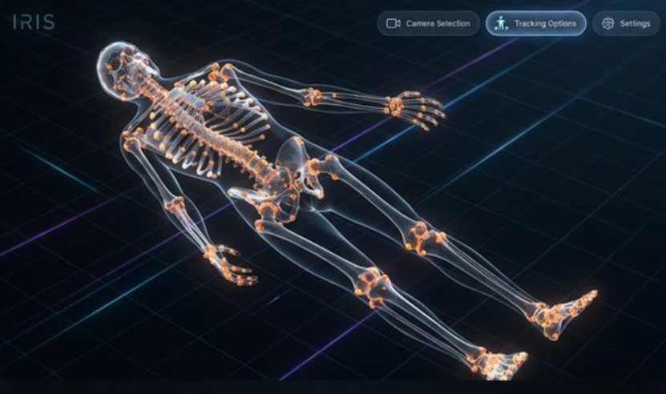

# IRIS Starter Application


This repo contains the official **IRIS Starter Application**, a production-ready template for building markerless 
motion capture applications.

IRIS handles all the complexity of streaming real-time pose data allowing you to focus on building out your 
core idea. If needed IRIS also supports running on existing video data to allow even higher accuracy.

This application is built with Electron and Vue 3, and Typescript. 3D assets are provided in `.obj` format.

## 🚀 Quick Start

Get your development environment running in minutes:

```powershell
# Install dependencies
npm install

# Launch the developer environment
npm run dev

# Build for production
npm run build
```
You will need a FREE licence key for IRIS available from [iris.cs.bath.ac.uk](https://iris.cs.bath.ac.uk/).

## 🛠️ Key Features
- **Real-time Pose Streaming**: Seamless integration with the IRIS vision engine.
- **Ready-to-use 3D Scene**: Three.js integration with OBJ/glTF support pre-configured.
- **Modern Tech Stack**: Built with Electron, Vite, and Vue 3 for optimal performance.

## 📁 Project Structure
- `src/pose.ts`: Logic for handling incoming pose data and keypoints.
- `src/App.vue`: Main 3D scene implementation and application UI.
- `src/composables/useIris.ts`: Composable for managing the IRIS stream connection.
- `public/assets/`: Directory for 3D assets (default: `SMPLX_neutral.obj`).

## 💡 Example Use Cases
- **Biomechanics Analysis**: Track joint angles and skeletal movement in real-time.
- **Virtual Avatars**: Drive 3D characters using live body tracking.
- **Human-Computer Interaction**: Build gesture-controlled interfaces and environments.
- **Fitness & Sports**: Analyze form and provide feedback for physical activities.

## 🧪 Technical Notes
- **Camera Configuration**: Ensure Windows Privacy Settings allow "Desktop App" access if the camera feed is not appearing.
- **Performance Optimization**: For production use, we recommend using `.glb` (Draco compressed) models rather than `.obj`.
- **Development Mock**: The SDK includes a `MockPoseStream` in `src/pose.ts` for development without active IRIS hardware.

## 🆘 Resources & Support 
Please request access from mrt64@bath.ac.uk if you can't see these repositories
- [Documentation](https://github.com/Bath-Impact-Lab/IRIS-App-Starter-Projehttps://github.com/Bath-Impact-Lab/IRIS-App-Starter-Project/tree/main/documentation)
- [Issue Tracker](https://github.com/Bath-Impact-Lab/IRIS/issues)

Built with ❤️ by the **Bath Impact Lab**.

